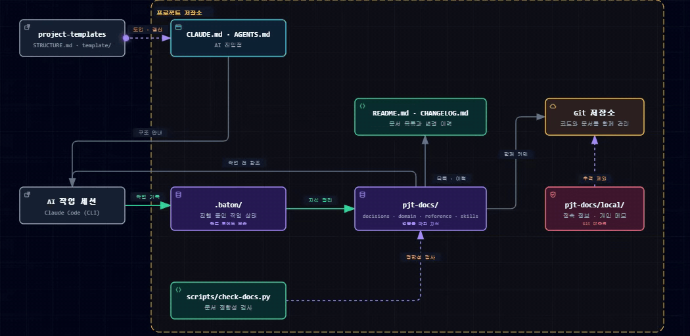

<div align="center">

# project-templates

**Claude Code(CLI)를 위한 프로젝트 지식·작업 이력 관리 템플릿**

개발 과정에서 내린 판단과 AI와 함께 작업한 이력을 기록하고,
다음 세션이나 다른 개발자가 다시 찾아 활용하기 위한 구조입니다.

</div>

---

## 한눈에 보기

### `pjt-docs/` — 확정된 지식

설계 판단과 그 이유, 도메인 규칙, 재사용할 노하우를 남깁니다.

### `.baton/` — 진행 중인 작업과 수정 이력

어디까지 했는지, 다음에 무엇을 할지, 어느 지점에서 막혔는지를 세션마다 갱신합니다. 화면이나 기능처럼 반복해서 손대는 단위마다 파일 하나를 두고, 언제 어느 기능을 왜 어떻게 바꿨는지를 그 파일에 쌓습니다. 같은 것을 다시 고칠 때 이전 맥락을 바로 찾습니다.

### 일반 Markdown 파일로 관리

전용 포맷도, 특정 도구의 전용 폴더도 아닙니다. 편집기나 GitHub 에서 그대로 읽힙니다.

### AI와 개발자가 같은 파일을 읽습니다

AI에게 따로 설명하지 않아도 됩니다. 사람이 검토하는 문서가 그대로 AI의 컨텍스트가 됩니다.

### 코드와 함께 Git으로 관리

문서를 코드와 같은 커밋에 담아, 변경과 그 이유가 한 이력에 남습니다.

> [!NOTE]
> 자동 설치와 운영 규칙은 현재 Claude Code(CLI)만 지원합니다.
> 다만 생성된 Markdown 문서는 다른 AI 도구에서도 그대로 읽고 활용할 수 있습니다.

---

## 왜 만들었나

AI와 함께 개발하면 코드는 빠르게 쌓입니다. 그러나 다음 작업에서 정말 필요한 것은 코드만이 아니라, **그 코드가 만들어진 맥락**입니다.

#### 판단의 이유가 남지 않습니다

코드에는 최종 결과만 남습니다. 검토했다가 제외한 대안과 그 이유가 기록되지 않으면, 다음 세션의 AI나 다른 개발자가 같은 논의를 반복하거나 기존 결정을 무심코 되돌릴 수 있습니다.

#### 작업의 현재 상태가 사라집니다

AI 세션이 끝나면 어디까지 작업했는지, 다음에 무엇을 해야 하는지, 어느 지점에서 막혔는지도 함께 끊기기 쉽습니다.

#### 특정 도구와 기기에 지식이 묶입니다

도구 전용 폴더에만 기록하면 다른 AI 도구에서 활용하기 어렵습니다. 회사 PC에서 만든 맥락이 다른 PC로 이어지지 않는 문제도 생깁니다.

<br>

이 템플릿은 프로젝트의 지식을 평범한 Markdown 파일로 남깁니다. 코드와 함께 Git으로 관리할 수 있고, 특정 AI 도구에 종속되지 않으며, 개발자가 직접 읽고 검토할 수도 있습니다.

---

## 전체 구조

<picture>
  <source media="(prefers-color-scheme: dark)" srcset="docs/architecture-dark.gif">
  <source media="(prefers-color-scheme: light)" srcset="docs/architecture-light.gif">
  
</picture>

<br>

핵심은 **두 개의 기록 위치를 성격에 따라 분리**하는 것입니다.

| 구분 | `pjt-docs/` | `.baton/` |
|---|---|---|
| **성격** | 검증을 마친 프로젝트 지식 | 진행 중인 작업의 현재 상태와 이력 |
| **주요 내용** | 설계 판단과 이유, 도메인 규칙, 재사용할 노하우 | 진행 상황, 다음 할 일, 막힌 지점, 단위별 수정 이력 |
| **작성 방식** | 개발자가 검토하고 정리 | AI가 세션마다 생성·갱신 |
| **읽는 시점** | 작업을 시작하기 전에 관련 문서 확인 | 세션 시작 시 내 폴더의 `running`, `waiting` 확인. 단위를 고치기 전에 그 단위의 수정 이력 확인 |
| **수명** | 계속 유지하며 내용 갱신 | 완료 후에도 삭제하지 않고 작업 이력으로 보존 |
| **문서 검사** | `check-docs.py` 검사 대상 | 검사 대상 아님 |

`.baton/`에는 반복해서 손대는 단위(화면, 섹션, 인터페이스 등) 하나당 파일 하나를 사용합니다. 그 단위가 무엇인지는 도입할 때 프로젝트마다 정합니다. 작업이 끝나도 파일을 삭제하지 않고 수정 이력을 쌓으므로, 같은 화면을 다시 고칠 때 지난번에 어느 기능을 왜 어떻게 바꿨는지 바로 찾을 수 있습니다.

팀 저장소에서는 `.baton/<이름>/`으로 사용자별 폴더를 나눕니다. 세션은 자기 폴더만 읽고, 다른 사람의 배턴은 지시할 때만 봅니다. 개인 프로젝트도 같은 구조를 씁니다.

배턴은 규칙이 아니라 훅이 지킵니다. 열린 배턴이 없으면 파일 편집이 거부되고, 변경이 남은 채로는 턴이 끝나지 않으며, 배턴 없이는 커밋되지 않습니다.

작업 중 발견한 내용 가운데 다시 활용할 가치가 있는 지식은 개발자가 검토한 뒤 `pjt-docs/`에 정리합니다.

> **`.baton/`은 작업 기록이고, `pjt-docs/`는 프로젝트의 장기 기억입니다.**

---

## 설치

새 PC의 Claude Code에서 다음과 같이 요청합니다.

```
https://github.com/trance81/project-templates.git 클론해서 SETUP.md대로 전역 세팅해줘
```

Claude Code가 다음 작업을 수행합니다.

| 순서 | 수행 내용 |
|---|---|
| 1 | 이 저장소를 로컬에 클론 |
| 2 | 전역 지시 파일에 프로젝트 지식 관리 규칙을 등록 |
| 3 | `baton-init` 스킬을 `~/.claude/skills/`에 복사 |

설치 후에는 어느 프로젝트에서 작업하더라도 Claude Code가 이 구조를 인식하고 유지합니다.
자세한 절차는 [SETUP.md](SETUP.md)를 참고하세요.

---

## 사용 방법

별도의 명령어를 외울 필요 없이 Claude Code에 자연어로 요청하면 됩니다.

| 목적 | 요청 예시 |
|---|---|
| 새 프로젝트에 전체 구조 도입 | `이 프로젝트에 pjt-docs 구조 도입해줘` |
| 기존 프로젝트에 전체 구조 도입 | `이 프로젝트에 pjt-docs 구조 도입해줘` |
| 도입된 구조를 최신 표준으로 갱신 | `pjt-docs 최신 표준으로 갱신해줘` |
| 현재 프로젝트에 `.baton/`만 추가 | `이 프로젝트에 baton 추가해줘` |

기존 프로젝트에 도입할 때는 흩어져 있던 문서를 유형에 맞게 분류하고 옮깁니다. 자세한 기준은 [adopt.md](adopt.md)를 참고하세요.

단일 프로젝트인지, 하위에 코드 저장소가 여러 개인 그룹 루트인지, 코드가 없는 문서 작업인지에 따라 배치가 달라집니다. 형태별 요청 예시는 [도입 유형별 예시](#도입-유형별-예시)에 있습니다.

개발 중 기록할 판단이 생기면 그때그때 AI에 문서화를 요청하면 됩니다.

```
방금 결정한 인증 처리 방식을 pjt-docs에 기록해줘.
대안으로 검토한 방식과 제외한 이유도 함께 남겨줘.
```

이때 문서 메타데이터(제목, 상태, 날짜)와 `pjt-docs/README.md` 목록도 함께 갱신됩니다.

---

## 프로젝트에 생성되는 항목

```
<프로젝트 루트>/
├── CLAUDE.md                 # Claude Code 진입점
├── AGENTS.md                 # 다른 AI 도구를 위한 공통 진입점
├── scripts/
│   ├── check-docs.py         # 프로젝트 문서 검사 스크립트
│   └── baton-hook.mjs        # 배턴 없는 편집·턴 종료·커밋을 막는 훅
│
├── pjt-docs/                 # ── 확정된 지식 ──────────────
│   ├── README.md             # 관리 대상 문서 목록
│   ├── CHANGELOG.md          # 릴리스·마일스톤 요약 (쓰는 프로젝트만)
│   ├── HELP.md               # 개발자를 위한 사용 안내
│   ├── overview.md           # 프로젝트 개요
│   ├── decisions/            # 설계 판단, 결정 이유, 재검토 조건
│   ├── domain/               # 업무 규칙, 용어, 프로세스
│   ├── reference/            # 외부 자료 원본과 가공 문서
│   ├── skills/               # 다른 프로젝트에서도 재사용할 노하우
│   ├── troubleshooting/      # 문제와 해결 방법
│   └── local/                # 접속 정보·개인 메모 (기본 Git 미추적)
│
└── .baton/                   # ── 진행 중인 작업 · 수정 이력 ──
    ├── README.md             # 운영 규칙 + 이 프로젝트의 배턴 단위
    ├── <이름>/               # 사용자별 폴더 (Git 추적)
    │   └── <단위>.md         # 단위별 진행 상태와 수정 이력
    └── local/                # 이 PC의 사용자 이름 (Git 미추적)
```

- `CLAUDE.md`와 `AGENTS.md`에는 AI가 구조를 발견하는 데 필요한 최소한의 규칙만 둡니다. 프로젝트 지식 본문은 넣지 않습니다.
- 빈 폴더는 미리 만들지 않습니다. 각 유형의 첫 문서가 생길 때 해당 폴더를 생성합니다.

---

## Git 사용 여부에 따른 관리

### Git을 사용하는 프로젝트 (권장)

| 항목 | 관리 방법 |
|---|---|
| **커밋 범위** | `pjt-docs/`와 `.baton/`을 코드와 함께 커밋 |
| **커밋 단위** | 문서 변경은 가능하면 그 판단을 발생시킨 코드 변경과 같은 커밋에 포함 |
| **비공개 정보** | `pjt-docs/local/`은 `.gitignore`에 추가해 추적하지 않음 |
| **팀 공유** | 일반 코드와 마찬가지로 `pull`, `push`로 공유하고 충돌도 같은 방식으로 해결 |
| **잦은 변경** | `.baton/`은 작업 중 자주 바뀌므로, 부담되면 작업을 마칠 때 코드와 함께 커밋 |

### Git을 사용하지 않는 프로젝트

`pjt-docs/`와 `.baton/`은 일반 Markdown 파일이므로 Git 없이도 읽고 쓸 수 있습니다. 다만 변경 이력이 남지 않고, `.baton/`의 턴 종료 훅도 동작하지 않습니다. 이 훅은 `git status`로 변경 여부를 판정하기 때문입니다.

> [!TIP]
> 원격 저장소를 연결하지 않더라도 `git init`만 수행하는 것을 권장합니다.
> 프로토타입이나 초기 버전일수록 되돌릴 지점이 필요하고, 배턴에 쌓이는 수정 이력도 Git 없이는 이 PC 밖으로 나가지 못하기 때문입니다.

Git을 사용하지 않기로 했다면 다음을 보완합니다. 관리가 필요 없는 단순한 프로젝트라면 이대로도 충분합니다.

| 보완 항목 | 내용 |
|---|---|
| **변경 기록** | `.baton/<내 이름>/`의 수정 이력이 유일한 변경 기록이 됩니다. 다른 PC로는 넘어가지 않습니다 |
| **백업** | 프로젝트 폴더 전체를 정기적으로 백업하거나 동기화되는 위치에 보관 |
| **비공개 정보** | `.gitignore`가 동작하지 않으므로 `pjt-docs/local/`과 `.baton/local/`을 백업·공유 대상에서 직접 제외 |
| **배턴 강제** | 턴 종료 훅이 동작하지 않습니다. 세션 시작 때 진행 중인 배턴을 보여주는 안내만 남습니다 |

나중에 Git 저장소로 전환하더라도 별도의 마이그레이션은 필요하지 않습니다. 기존 문서를 그대로 첫 커밋에 포함하면 됩니다.

---

## 표준과 프로젝트 구조 갱신

### 표준 문서 갱신

표준 문서는 각 프로젝트에 복사하지 않습니다. 전역 지시가 클론된 이 저장소의 경로를 가리키고, AI가 작업할 때마다 `STRUCTURE.md`를 읽습니다.

| 갱신 대상 | 방법 |
|---|---|
| 표준 문서 | 이 저장소에서 `git pull` |
| `baton-init` 스킬 | [SETUP.md](SETUP.md)의 세팅 절차를 다시 실행 |

### 개별 프로젝트 구조 갱신

도입된 프로젝트에서 다음과 같이 요청합니다.

```
pjt-docs 최신 표준으로 갱신해줘
```

AI는 프로젝트의 `pjt-docs/README.md`에 기록된 표준 갱신일을 `STRUCTURE.md`의 날짜와 비교합니다. 날짜가 뒤처졌거나 값이 없으면 구조 갱신을 제안합니다.

| 갱신 대상 | 유지 대상 |
|---|---|
| `scripts/check-docs.py` | 프로젝트에서 직접 작성한 `pjt-docs/` 문서 |
| `CLAUDE.md`, `AGENTS.md`의 구조 인식 규칙 | 기존 `.baton/` 작업 파일 |
| `.gitignore` 규칙 | |
| 아직 없는 경우 `.baton/` 기본 구조 | |

자세한 절차는 [update.md](update.md)를 참고하세요.

---

## 문서 검사

프로젝트 루트에서 다음 명령을 실행합니다.

```bash
python scripts/check-docs.py
```

검사 스크립트는 다음 항목을 확인합니다.

| 검사 항목 | 내용 |
|---|---|
| **메타데이터 누락** | 제목, 상태, 날짜 등 필수 문서 메타데이터가 빠진 문서 |
| **목록 불일치** | `pjt-docs/README.md`에는 있으나 실제 파일이 없거나, 파일은 있으나 목록에 없는 경우 |
| **끊어진 링크** | 존재하지 않는 파일을 가리키는 내부 링크 |
| **오래된 문서** | `status: active` 상태이지만 장기간 갱신되지 않은 문서 |

`pjt-docs/local/`과 `pjt-docs/reference/원본/`은 검사 대상에서 제외합니다.

---

## 이 저장소의 구성

| 경로 | 설명 |
|---|---|
| [STRUCTURE.md](STRUCTURE.md) | 프로젝트 지식 관리 구조를 정의한 기준 문서 |
| [template/](template/) | 새 프로젝트에 복사하는 기본 파일 |
| [skills/baton-init/](skills/baton-init/) | 프로젝트에 `.baton/`을 도입하는 Claude Code 스킬 |
| [adopt.md](adopt.md) | 신규·기존 프로젝트에 구조를 도입하는 절차 |
| [update.md](update.md) | 도입된 프로젝트를 최신 표준으로 갱신하는 절차 |
| [SETUP.md](SETUP.md) | PC별 전역 설치 및 설정 절차 |
| [docs/](docs/) | README 에 넣는 구조 다이어그램 GIF (라이트 · 다크) |

---

## 운영 원칙 요약

1. 진행 중인 작업은 `.baton/`에 기록합니다.
2. 검증을 마친 지식만 `pjt-docs/`에 정리합니다.
3. 프로젝트 지식은 코드와 함께 변경하고 검토합니다.
4. 완료된 배턴도 삭제하지 않고 작업 이력으로 보존합니다.
5. 접속 정보와 개인 메모는 `pjt-docs/local/`에 두고 공유하지 않습니다.
6. 문서 목록과 실제 파일의 일치 여부를 `check-docs.py`로 점검합니다.

> 이 구조의 목적은 문서를 많이 만드는 것이 아닙니다.
> 다음 개발자와 다음 AI 세션이 같은 판단을 반복하지 않도록,
> **다시 사용할 가치가 있는 맥락**을 남기는 것입니다.

---

## 도입 유형별 예시

표준 파일은 세 경우 모두 같습니다. 도입 요청에 조건만 덧붙이면 배치가 달라집니다.

| 유형 | 조건 | 배치 |
|---|---|---|
| [단일 프로젝트](#단일-프로젝트) | 코드 저장소 하나 | 기본형 |
| [그룹 루트](#그룹-루트-풀스택) | 하위에 코드 저장소 여러 개 | 루트에 문서 전용 저장소, 영역별 하위폴더 |
| [문서 작업](#문서-작업-프로젝트) | 코드 없음 | 산출물과 지식을 분리 |

### 단일 프로젝트

```
이 프로젝트에 pjt-docs 구조 도입해줘
```

```
my-app/                      ← Git 저장소
├── CLAUDE.md · AGENTS.md
├── src/
├── pjt-docs/
└── .baton/kwcho/
    └── login-form.md        ← 반복 수정 단위마다 한 장
```

문서와 코드를 같은 커밋에서 관리합니다. 배턴 파일명은 작업 이름이 아니라 반복해서 손대는 단위(화면, 컴포넌트 등)의 식별자입니다. 단위는 도입할 때 정합니다.

### 그룹 루트 (풀스택)

```
이 프로젝트에 pjt-docs 구조 도입해줘.
루트는 Git 저장소가 아니고 하위에 코드 저장소가 셋 있어 (frontend, backend, webview).

- 루트에 문서 전용 저장소를 만들고 코드 저장소 셋은 .gitignore 로 제외해줘.
- domain/ 과 troubleshooting/ 은 frontend/ backend/ webview/ 하위폴더로 나눠줘.
- decisions/ 는 공통으로 두고, 한쪽에만 걸리면 본문에 영향 범위를 적어줘.
- 배턴 단위는 화면이고, 파일명은 fe- / be- / wv- 접두사 뒤에 화면 ID 를 붙여줘.
```

```
project-root/                ← 문서 전용 Git 저장소
├── CLAUDE.md · AGENTS.md
├── frontend/  backend/  webview/    ← 각자 별도 저장소 (.gitignore 로 제외)
├── pjt-docs/
│   ├── decisions/                   공통 결정
│   ├── domain/frontend/  domain/backend/  domain/webview/
│   └── troubleshooting/frontend/  ...
└── .baton/kwcho/                ← 문서 저장소 안에서 Git 추적
    ├── fe-PSBSOP00400.md         화면 하나의 조회·저장·결재 수정 이력이 한 파일에
    └── be-if-eai-103.md
```

한 작업이 프론트엔드와 백엔드를 함께 건드리면 두 파일에 각각 이력 항목을 남기되, 진행 상태는 주가 되는 쪽에만 적고 다른 쪽은 그 파일을 가리킵니다.

### 문서 작업 프로젝트

```
이 프로젝트에 pjt-docs 구조 도입해줘.
코드는 없고 분석·설계 문서를 만드는 프로젝트야.

- 최종 산출물(설계서, 보고서)은 deliverables/ 에 두고 pjt-docs 에는 넣지 마.
- 받은 자료는 pjt-docs/reference/원본/ 에 그대로 보존해줘.
- 산출물에 반영한 판단은 decisions/ 에, 업무 규칙과 용어는 domain/ 에 남겨줘.
- 배턴 단위는 산출물이야. 파일명은 산출물 이름으로 지어줘.
```

```
analysis-project/
├── CLAUDE.md · AGENTS.md
├── deliverables/            ← 전달하는 산출물
│   ├── 요구사항정의서.md
│   └── 화면설계서.md
├── pjt-docs/                ← 그 산출물이 그렇게 나온 근거
│   ├── decisions/  domain/
│   └── reference/원본/
└── .baton/kwcho/
    └── 요구사항정의서.md     ← 개정할 때마다 수정 이력이 쌓임
```

산출물만 남기면 다음 개정 때 각 항목을 왜 그렇게 썼는지 다시 조사하게 됩니다.

> [!NOTE]
> 도입할 때 지정한 규칙은 AI가 `CLAUDE.md`와 `AGENTS.md`에 적어 둡니다.
> 그래야 다음 세션이 같은 방식으로 이어갑니다.
